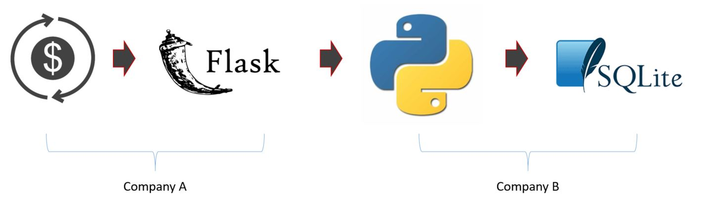
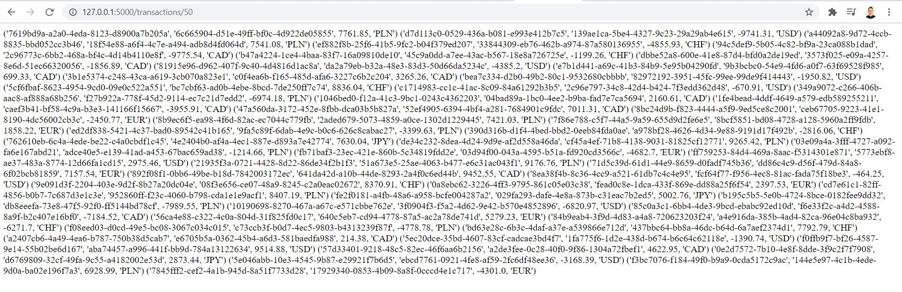

<h2>Data Pipeline with Flask and SQLite in Python</h2>
<h3>Intro</h3>

Simulating data streaming using data pipeline:

<ol>
  <li>Generating data in the transaction app of Company A.</li>
  <li>API enables accesing data resource with get method.</li>
  <li>Requesting resource thorough API by Company B.</li>
  <li>Handling big data sets with Python in Company B.</li>
  <li>Inserting data into data base of Company B.</li>
</ol>
<h3>Demo</h3>
<ul>
  <li>I can send the get request through a web-browser getting transactions:</li>
   
  
  <li>The same get request is being sent by the Company B.</li>
</ul>
